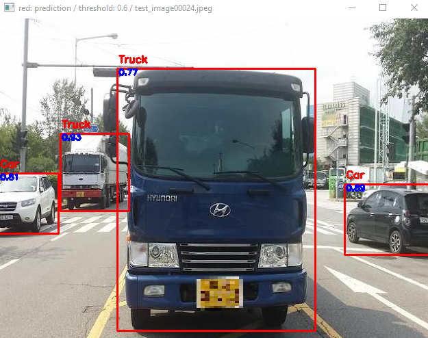
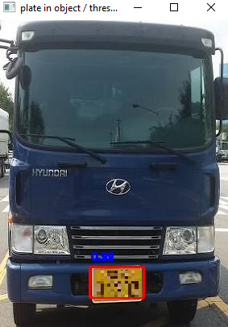
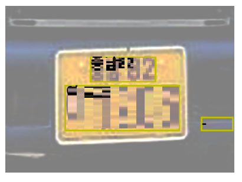

<div align="center">
<p>



</p>
<br>
<div>
car object detection and car license plate detection, Azure OCR<br>
classes = ["Unknown", "Car", "Bike", "Bus", "Truck", "Etc_vehicle"]<br>
default_path is "absoulte_path/Desktop/"<br>
save model in default_path/weights<br>
</div>

### Train
```cmd
python train.py --dataset Car --epochs 20
```


### Test
python train.py --dataset Car --resume model_car_19.pth --test-only


### Inference
```cmd
python train.py --dataset Car --resume model_car_19.pth --visualize-only
python train.py --dataset Car --resume model_car_19.pth --visualize-only --visualize-plate --valid-only-img
```

<br>
<br>
