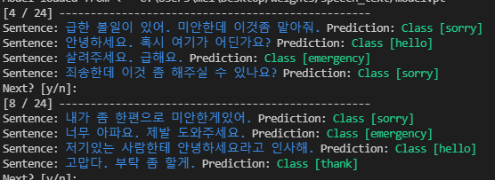
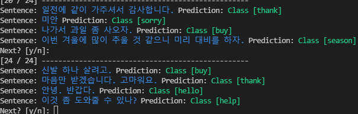
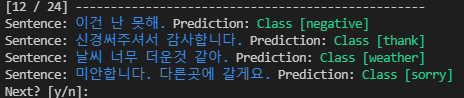

<div align="center">
<p>



</p>
<br>
<div>
speech to text and classification text<br>
classes = ["hello", "sorry", "thank", "emergency", "weather", <br>
"help", "buy", "negative", "season", "unknown"]<br>
default_path is "absoulte_path/Desktop/"<br>
save model in default_path/weights<br>
</div>

### Train
```cmd
python train.py --test
python train.py --test --model-name CNN1d
python train.py --test --shuffle-data
python train.py --test --model-name CNN1d --epochs 100 --emb-dim 400 --out-channel 256
```


### Test
python train.py --test-only
python train.py --test-only --model-name CNN1d


### Inference
```cmd
python prediction.py
python prediction.py --shuffle-data
python prediction.py --shuffle-data --model-name CNN1d
python prediction.py --shuffle-data --model-name CNN1d --input-pred
python prediction.py --shuffle-data --input-pred
```

<br>
<br>
