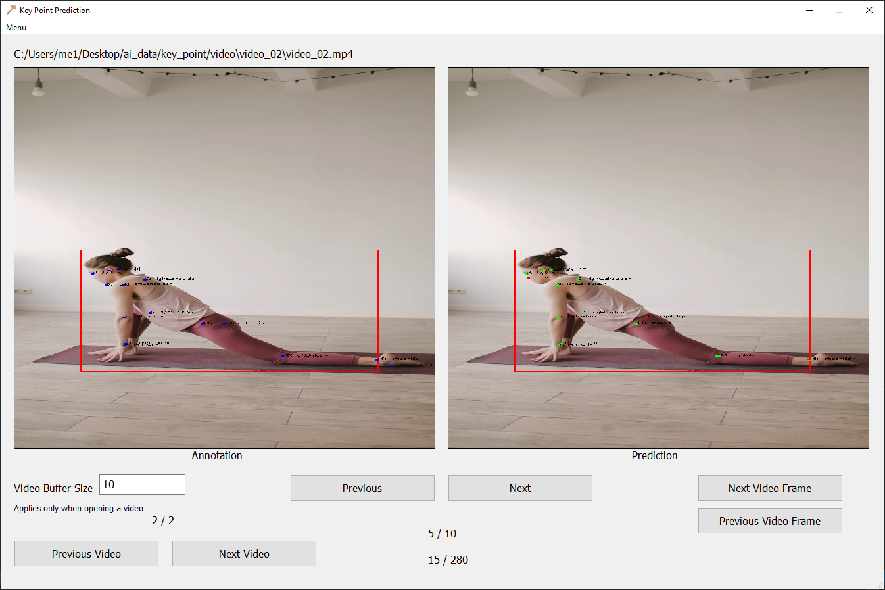

 

prediction incorrect key point with annotation 
used pretrained model keypointrcnn_resnet50_fpn 
create log incorrect point 
-- annotations.json file format -- 
filename, width, hegiht, fps, total_frame,  
annotations["frame"], annotations["bbox"], annotations["keypoints"] 

 
 